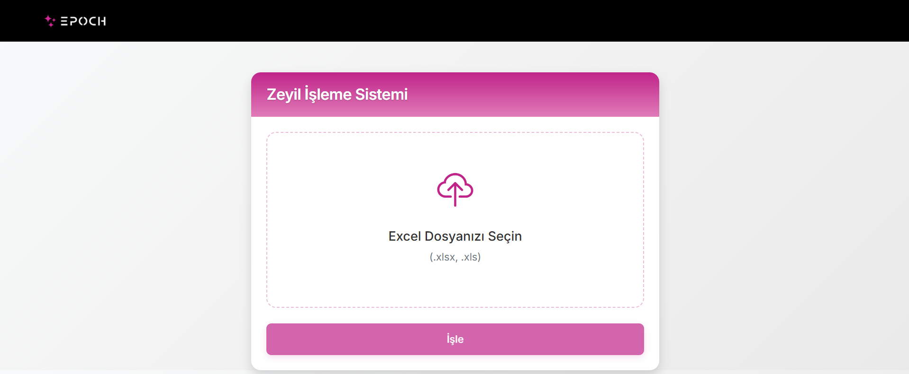
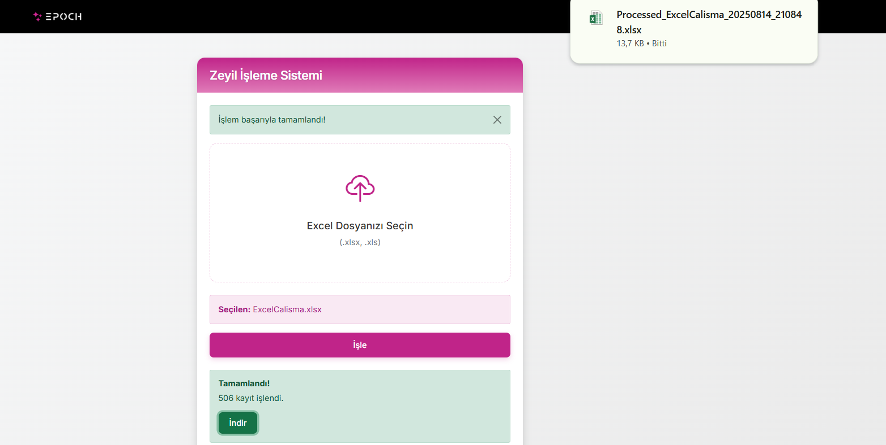
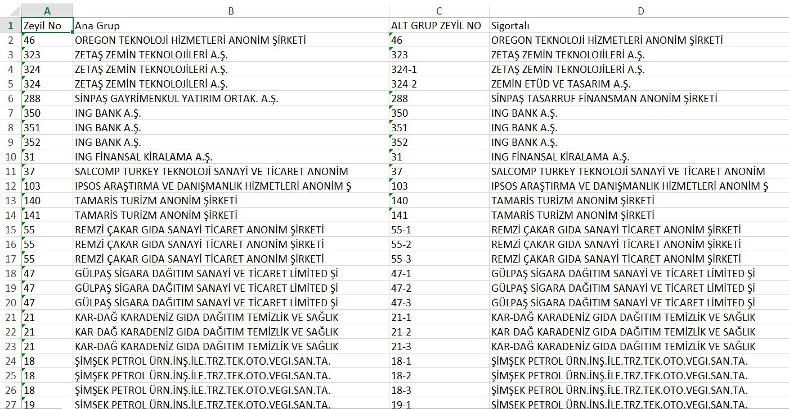

# ZeylProcessor 🏢

**Excel tabanlı sigorta zeyil kayıtları işleme ve alt grup numaraları otomatik atama sistemi**

[](https://dotnet.microsoft.com/)
[](https://www.epplussoftware.com/)
[](https://getbootstrap.com/)
[](LICENSE)

## 🎬 Demo

<p align="center">
  
</p>

<p align="center"><em>Drag & drop ile Excel yükleme, işleme ve indirme süreci</em></p>

## 📸 Ekran Görüntüleri

<p align="center">
  
  
  
</p>

## 🎯 Ne İşe Yarar?

ZeylProcessor, sigorta şirketlerinin zeyil (poliçe eki) işlemlerini otomatikleştiren web uygulamasıdır. Excel dosyalarını yükler, akıllı algoritma ile işler ve sonuçları indirir.

### Çözüm Sağladığı Problemler:
- 🚫 **Manuel Hata Riski**: İnsan kaynaklı numaralandırma hatalarını önler
- ⚡ **Zaman Kaybı**: Binlerce kayıtlı Excel dosyalarını saniyeler içinde işler
- 🔄 **Tutarlılık**: Aynı sigortalılar için her zaman aynı alt grup numaralarını atar
- 🧠 **Desen Tanıma**: Tekrar eden sigortalı dizilimlerini otomatik tespit eder

## 🧮 Algoritma Mantığı

ZeylProcessor, sigortalı isimlerindeki tekrar eden örüntüleri analiz ederek akıllı numaralandırma yapar:

### 📏 Temel Kurallar

| Durum | Kural | Örnek |
|-------|--------|-------|
| **Tek Kayıt** | Alt numara verilmez | `140` → `140` |
| **Çoklu Kayıt (Desen Yok)** | Sıralı numaralama | `231-1`, `231-2`, `231-3` |
| **Tekrar Eden Desen** | Sabit pozisyon numarası | Aşağıda detay ↓ |

### 🔄 Desen Tanıma Örneği

**Giriş Verisi (Excel A-D sütunları):**
```
Zeyil No | Ana Grup | [Boş] | Sigortalı
231      | GRUP-A   |       | PELTIM MAKINA
231      | GRUP-A   |       | SINCAN KAĞIT  
231      | GRUP-A   |       | HAYAT KIMYA
231      | GRUP-A   |       | PELTIM MAKINA  ← Desen tekrarı
231      | GRUP-A   |       | SINCAN KAĞIT
231      | GRUP-A   |       | HAYAT KIMYA
```

**Algoritma Çıktısı:**
```
Zeyil No | Ana Grup | ALT GRUP ZEYİL NO | Sigortalı
231      | GRUP-A   | 231-1            | PELTIM MAKINA
231      | GRUP-A   | 231-2            | SINCAN KAĞIT
231      | GRUP-A   | 231-3            | HAYAT KIMYA
231      | GRUP-A   | 231-1            | PELTIM MAKINA ← Aynı sigortalı, aynı numara
231      | GRUP-A   | 231-2            | SINCAN KAĞIT
231      | GRUP-A   | 231-3            | HAYAT KIMYA
```

## ✨ Özellikler

- 🎨 **Modern UI**: Bootstrap 5 + gradient tasarım
- 🖱️ **Drag & Drop**: Dosya sürükle-bırak desteği
- 📊 **Excel İşleme**: .xlsx/.xls okuma/yazma
- 🧠 **Akıllı Algoritma**: Tekrar eden desen tespiti
- 🚀 **Performans**: Asenkron işleme
- 🌐 **RESTful API**: Swagger dokümantasyonu

## 📁 Proje Yapısı

```
ZeylAPI/
├── 📁 Controllers/
│   └── ZeylController.cs          # API endpoint'leri
├── 📁 Services/
│   ├── ExcelService.cs            # Excel okuma/yazma (EPPlus)
│   ├── ZeylService.cs             # Ana algoritma (desen tespiti)
│   ├── FileStorageService.cs      # Geçici dosya saklama
│   └── 📁 Interfaces/             # Servis interface'leri
├── 📁 Models/Entities/
│   └── ZeylRecord.cs              # Zeyil kayıt modeli
├── 📁 wwwroot/
│   ├── 📁 css/zeyil.css          # Custom gradient stilleri
│   ├── 📁 js/zeyil.js            # Frontend JavaScript
│   ├── 📁 images/                # Logo ve görseller
│   └── index.html                 # Ana sayfa
└── Program.cs                     # Uygulama yapılandırması
```

## 🚀 Kurulum

1. **Projeyi klonlayın:**
```bash
git clone https://github.com/username/ZeylProcessor.git
cd ZeylProcessor
```

2. **Bağımlılıkları yükleyin:**
```bash
dotnet restore
```

3. **Projeyi çalıştırın:**
```bash
dotnet run
```

4. **Erişim:**
- Frontend: http://localhost:5000
- API Docs: http://localhost:5000/swagger

## 📡 API Kullanımı

### Excel Dosyası Yükleme ve İşleme

**POST** `/api/zeyil/process`

```bash
curl -X POST \
  http://localhost:5000/api/zeyil/process \
  -H "Content-Type: multipart/form-data" \
  -F "file=@zeyil-kayitlari.xlsx"
```

**Yanıt:**
```json
{
  "success": true,
  "message": "Başarıyla işlendi",
  "processedCount": 150,
  "downloadId": "abc123-def456-ghi789"
}
```

### İşlenmiş Dosyayı İndirme

**GET** `/api/zeyil/download/{downloadId}`

```bash
curl -X GET \
  http://localhost:5000/api/zeyil/download/abc123-def456-ghi789 \
  -o islenmis-zeyil-kayitlari.xlsx
```

### Hata Durumları

```json
// Dosya seçilmedi
{
  "message": "Dosya seçilmedi"
}

// Geçersiz format
{
  "message": "Geçersiz dosya formatı"
}

// Veri bulunamadı
{
  "message": "Dosyada veri bulunamadı"
}
```

## 🛠️ Teknolojiler

| Backend | Frontend | 
|---------|----------|
| ASP.NET Core 6.0+ | Bootstrap 5.1+ |
| EPPlus | Vanilla JavaScript |
| Swagger/OpenAPI | Bootstrap Icons |

## 🤝 Katkıda Bulunma

1. Bu repository'yi fork edin
2. Feature branch oluşturun (`git checkout -b feature/yeni-ozellik`)
3. Değişikliklerinizi commit edin (`git commit -am 'Yeni özellik eklendi'`)
4. Pull Request oluşturun

## 📄 Lisans

Bu proje MIT lisansı altında lisanslanmıştır.

---

⭐ **Proje faydalıysa yıldız vermeyi unutmayın!** ⭐
