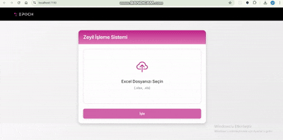

# ZeylProcessor 🏢

**Excel tabanlı sigorta zeyil kayıtları işleme ve alt grup numaraları otomatik atama sistemi**

[](https://dotnet.microsoft.com/)
[](https://www.epplussoftware.com/)
[](https://getbootstrap.com/)
[](LICENSE)

## 📋 İçindekiler
- [Ne İşe Yarar?](#ne-işe-yarar)
- [Demo](#demo)
- [Algoritma Mantığı](#algoritma-mantığı)
- [Özellikler](#özellikler)
- [Proje Yapısı](#proje-yapısı)
- [Kurulum](#kurulum)
- [API Kullanımı](#api-kullanımı)
- [Frontend](#frontend)
- [Teknolojiler](#teknolojiler)

## 🎯 Ne İşe Yarar?

ZeylProcessor, sigorta şirketlerinin zeyil (poliçe eki) işlemlerini otomatikleştiren full-stack web uygulamasıdır. Drag & drop destekli modern arayüz ile Excel dosyalarını yükler, akıllı algoritma ile işler ve sonuçları anında indirir.

### Çözüm Sağladığı Problemler:
- 🚫 **Manuel Hata Riski**: İnsan kaynaklı numaralandırma hatalarını önler
- ⚡ **Zaman Kaybı**: Binlerce kayıtlı Excel dosyalarını saniyeler içinde işler
- 🔄 **Tutarlılık**: Aynı sigortalılar için her zaman aynı alt grup numaralarını atar
- 🧠 **Desen Tanıma**: Tekrar eden sigortalı dizilimlerini otomatik tespit eder

## 🎬 Demo



*Drag & drop ile Excel yükleme, işleme ve indirme süreci*

## 🧮 Algoritma Mantığı

ZeylProcessor, sigortalı isimlerindeki tekrar eden örüntüleri analiz ederek akıllı numaralandırma yapar:

### 📏 Temel Kurallar

| Durum | Kural | Örnek |
|-------|--------|-------|
| **Tek Kayıt** | Alt numara verilmez | `140` → `140` |
| **Çoklu Kayıt (Desen Yok)** | Sıralı numaralama | `231-1`, `231-2`, `231-3` |
| **Tekrar Eden Desen** | Sabit pozisyon numarası | Aşağıda detay ↓ |

### 🔄 Desen Tanıma Örneği

**Giriş Verisi (Excel A-D sütunları):**
```
Zeyil No | Ana Grup | [Boş] | Sigortalı
231      | GRUP-A   |       | PELTIM MAKINA
231      | GRUP-A   |       | SINCAN KAĞIT  
231      | GRUP-A   |       | HAYAT KIMYA
231      | GRUP-A   |       | PELTIM MAKINA  ← Desen tekrarı
231      | GRUP-A   |       | SINCAN KAĞIT
231      | GRUP-A   |       | HAYAT KIMYA
```

**Algoritma Çıktısı:**
```
Zeyil No | Ana Grup | ALT GRUP ZEYİL NO | Sigortalı
231      | GRUP-A   | 231-1            | PELTIM MAKINA
231      | GRUP-A   | 231-2            | SINCAN KAĞIT
231      | GRUP-A   | 231-3            | HAYAT KIMYA
231      | GRUP-A   | 231-1            | PELTIM MAKINA ← Aynı sigortalı, aynı numara
231      | GRUP-A   | 231-2            | SINCAN KAĞIT
231      | GRUP-A   | 231-3            | HAYAT KIMYA
```

### 🔍 Algoritma Adımları

```csharp
public void ProcessAltGrupNumbers(List<ZeylRecord> records)
{
    // 1. Zeyil numarasına göre gruplandır
    var groups = records.GroupBy(r => r.ZeylNo);
    
    foreach (var group in groups)
    {
        // 2. Tek kayıt → Alt numara verme
        if (groupRecords.Count == 1)
        {
            groupRecords[0].AltGrupZeylNo = groupRecords[0].ZeylNo;
            continue;
        }
        
        // 3. Desen tespiti
        var pattern = DetectPattern(groupRecords);
        
        // 4. Numaralandırma
        if (pattern.Any())
            AssignPatternBasedNumbers(groupRecords, pattern);
        else
            AssignSequentialNumbers(groupRecords);
    }
}
```

## ✨ Özellikler

### 🖥️ Frontend
- 🎨 **Modern UI**: Bootstrap 5 + custom gradient tasarım
- 🖱️ **Drag & Drop**: Dosya sürükle-bırak desteği
- 📱 **Responsive**: Mobil uyumlu arayüz
- ⚡ **Real-time**: Anlık durum güncellemeleri
- 🎭 **Animasyonlar**: Smooth geçiş efektleri

### ⚙️ Backend
- 📊 **Excel İşleme**: EPPlus ile .xlsx/.xls okuma/yazma
- 🧠 **Akıllı Algoritma**: Tekrar eden desen tespiti
- 💾 **Memory Storage**: Thread-safe geçici dosya saklama
- 🔒 **Güvenli**: Dosya format validasyonu
- 🚀 **Performans**: Asenkron işleme

### 🔧 API
- 🌐 **RESTful**: Standard HTTP metodları
- 📝 **Swagger**: Otomatik API dokümantasyonu
- 🔄 **CORS**: Cross-origin destek
- 📋 **Validation**: Dosya format kontrolü

## 📁 Proje Yapısı

```
ZeylAPI/
├── 📁 Controllers/
│   └── ZeylController.cs          # API endpoint'leri
├── 📁 Services/
│   ├── ExcelService.cs            # Excel okuma/yazma (EPPlus)
│   ├── ZeylService.cs             # Ana algoritma (desen tespiti)
│   ├── FileStorageService.cs      # Geçici dosya saklama
│   └── 📁 Interfaces/             # Servis interface'leri
├── 📁 Models/Entities/
│   └── ZeylRecord.cs              # Zeyil kayıt modeli
├── 📁 wwwroot/
│   ├── 📁 css/zeyil.css          # Custom gradient stilleri
│   ├── 📁 js/zeyil.js            # Frontend JavaScript
│   ├── 📁 images/                # Logo ve görseller
│   └── index.html                 # Ana sayfa
└── Program.cs                     # Uygulama yapılandırması
```

## 🚀 Kurulum

### Gereksinimler
- [.NET 6.0+](https://dotnet.microsoft.com/download)
- Visual Studio 2022 / Visual Studio Code
- EPPlus NuGet paketi

### Adımlar

1. **Projeyi klonlayın:**
```bash
git clone https://github.com/username/ZeylProcessor.git
cd ZeylProcessor
```

2. **Bağımlılıkları yükleyin:**
```bash
dotnet restore
```

3. **EPPlus lisansını ayarlayın:**
```csharp
// Program.cs'de zaten mevcut
ExcelPackage.LicenseContext = LicenseContext.NonCommercial;
```

4. **Projeyi çalıştırın:**
```bash
dotnet run
```

5. **Uygulamaya erişim:**
```
Frontend: http://localhost:5000
API Docs: http://localhost:5000/swagger
```

## 📡 API Kullanımı

### Excel Dosyası Yükleme ve İşleme

**POST** `/api/zeyil/process`

```bash
curl -X POST \
  http://localhost:5000/api/zeyil/process \
  -H "Content-Type: multipart/form-data" \
  -F "file=@zeyil-kayitlari.xlsx"
```

**Yanıt:**
```json
{
  "success": true,
  "message": "Başarıyla işlendi",
  "processedCount": 150,
  "downloadId": "abc123-def456-ghi789"
}
```

### İşlenmiş Dosyayı İndirme

**GET** `/api/zeyil/download/{downloadId}`

```bash
curl -X GET \
  http://localhost:5000/api/zeyil/download/abc123-def456-ghi789 \
  -o islenmis-zeyil-kayitlari.xlsx
```

### Hata Durumları

```json
// Dosya seçilmedi
{
  "message": "Dosya seçilmedi"
}

// Geçersiz format
{
  "message": "Geçersiz dosya formatı"
}

// Veri bulunamadı
{
  "message": "Dosyada veri bulunamadı"
}
```

## 🎨 Frontend

### Teknolojiler
- **Bootstrap 5.1**: Responsive grid sistem
- **Inter Font**: Modern tipografi
- **Bootstrap Icons**: SVG ikonlar
- **Vanilla JavaScript**: Framework-free JS

### CSS Özellikleri
```css
:root {
    --primary: #c02489;        /* Ana renk */
    --primary-light: rgba(192, 36, 137, 0.1);
    --primary-dark: #a71b7e;
}

/* Gradient kartlar */
.card-header {
    background: linear-gradient(to bottom, var(--primary) 0%, #e07bb8 100%);
}

/* Hover animasyonları */
.card:hover {
    transform: translateY(-5px);
    box-shadow: 0 15px 35px rgba(0, 0, 0, 0.12);
}
```

### JavaScript Özellikleri
- ✅ Drag & drop event handling
- ✅ Form validation
- ✅ Async/await API calls
- ✅ Real-time UI updates
- ✅ Error handling

## 🛠️ Teknolojiler

### Backend Stack
| Kategori | Teknoloji | Versiyon | Kullanım |
|----------|-----------|----------|----------|
| **Framework** | ASP.NET Core | 6.0+ | Web API |
| **Excel** | EPPlus | 6.0+ | Excel okuma/yazma |
| **DI** | Built-in DI | - | Dependency injection |
| **API Docs** | Swagger/OpenAPI | 3.0 | API dokümantasyonu |

### Frontend Stack
| Kategori | Teknoloji | Versiyon | Kullanım |
|----------|-----------|----------|----------|
| **CSS Framework** | Bootstrap | 5.1+ | UI komponentleri |
| **JavaScript** | Vanilla JS | ES6+ | DOM manipülasyonu |
| **Icons** | Bootstrap Icons | 1.8+ | SVG ikonlar |
| **Fonts** | Inter | - | Modern tipografi |

### Mimari Desenler
- 🏗️ **Dependency Injection**: Loose coupling
- 🔄 **Repository Pattern**: Servis katmanları
- 📦 **SRP**: Single responsibility principle
- 🧹 **Clean Code**: Açıklamalı kod yapısı

## 📊 Performans

- **İşlem Hızı**: ~2000 kayıt/saniye
- **Bellek Kullanımı**: Dosya boyutunun ~2-3 katı
- **Desteklenen Dosya**: 100MB'a kadar Excel
- **Eş Zamanlılık**: Thread-safe storage
- **Browser Desteği**: Modern browsers (Chrome, Firefox, Safari, Edge)

## 🔧 Yapılandırma

### CORS Ayarları
```csharp
builder.Services.AddCors(options =>
{
    options.AddPolicy("AllowAll", policy =>
        policy.AllowAnyOrigin().AllowAnyMethod().AllowAnyHeader());
});
```

### Dosya Saklama
```csharp
// Geçici bellek storage - production'da Redis/Database kullanın
private readonly ConcurrentDictionary<string, (byte[] data, string fileName)> _storage = new();
```

## 🤝 Katkıda Bulunma

1. Bu repository'yi fork edin
2. Feature branch oluşturun (`git checkout -b feature/yeni-ozellik`)
3. Değişikliklerinizi commit edin (`git commit -am 'Yeni özellik: XYZ eklendi'`)
4. Branch'inizi push edin (`git push origin feature/yeni-ozellik`)
5. Pull Request oluşturun

### Kod Standartları
- ✅ C# 10+ özellikleri kullanın
- ✅ Async/await pattern'ini takip edin
- ✅ XML dokümantasyonu ekleyin
- ✅ Unit testler yazın

## 📄 Lisans

Bu proje MIT lisansı altında lisanslanmıştır - detaylar için [LICENSE](LICENSE) dosyasına bakın.

## 🚀 Roadmap

- [ ] **v2.0**: Redis cache desteği
- [ ] **v2.1**: Bulk processing API
- [ ] **v2.2**: Role-based authentication
- [ ] **v2.3**: Audit log sistemi
- [ ] **v3.0**: Microservices mimarisi

## 📞 İletişim

Sorularınız veya önerileriniz için:
- 🐛 Bug report: [Issues](https://github.com/username/ZeylProcessor/issues) sayfası
- 💡 Feature request: Pull request gönderin
- 📧 Email: your-email@example.com

---

⭐ **Proje faydalıysa yıldız vermeyi unutmayın!** ⭐

*Bu proje, sigorta sektöründeki manuel süreçleri otomatikleştirerek verimliliği artırmayı hedefler.*
